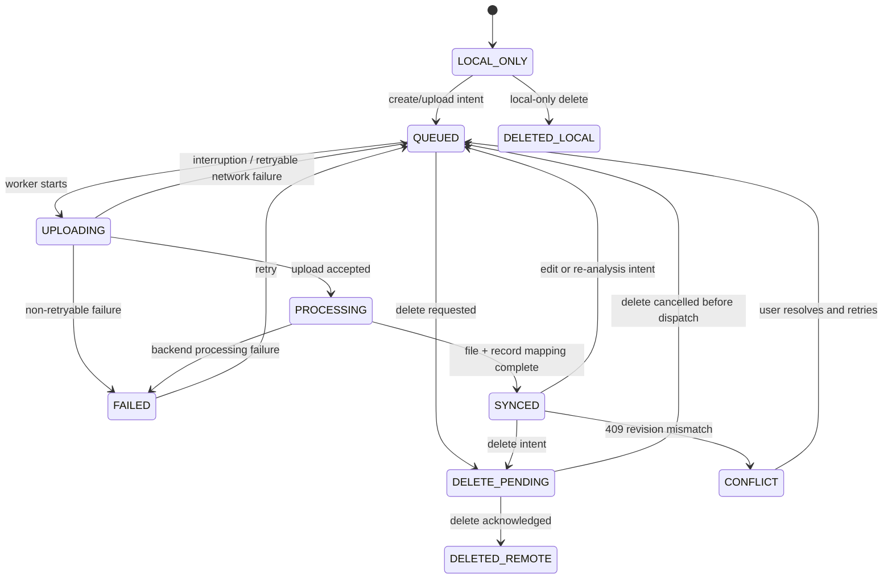

# AstroJournal V2 Sync Contract

Status: Draft for Sprint 1
Scope: Identifier, file/record ownership, synchronization, duplicate, deletion,
and conflict contracts. This document is a design contract only; it does not
change V1 code or the SQLite v29 schema.

## 1. Goals and non-goals

V2 keeps the V1 local-first experience while making TC-Backend the canonical
store for shared photo assets and observation data. Mobile SQLite becomes a
catalog store, offline projection, cache, and sync outbox. A V1 SQLite primary
key must never be used as a TC-Backend SHA-256 `file_id`.

This contract does not define authentication, backend implementation, database
migrations, or a UI. All network writes must be safely retryable.

## 2. Identifier model

| Identifier | Definition / format | Created by | Lifetime and storage | Sent to API | Duplicate / idempotency rule |
|---|---|---|---|---|---|
| `local_photo_id` | Mobile SQLite `photos.id` UUID | Mobile | Device-local; retained while the local projection exists | Never as a remote primary key; may be diagnostic metadata | No cross-device meaning |
| `client_file_id` | UUID v4 generated before the first upload | Mobile | Persistent local projection and upload outbox until remote mapping is durable | Yes, on every upload/retry | Same ID means the same logical upload request; backend returns the original result |
| `backend_file_id` | TC-Backend SHA-256 content identifier | Backend after hashing/lookup | Backend canonical; cached locally once known | Received and subsequently referenced | Same SHA-256 maps to one file asset within the authorized tenant/ownership scope |
| `local_record_id` | Existing V1 `shooting_records.id` UUID | Mobile | Device-local projection; V1 value retained during migration | Only as `legacy_local_id` / diagnostic correlation | Never used as backend record identity |
| `backend_record_id` | Astro `ObservationRecord` UUID | Backend, or client UUID accepted by create API | Backend canonical; locally mapped for offline projection | Yes | Idempotent create uses `client_record_id`, not file hash |
| `catalog_object_id` | Existing catalog string, e.g. `M27`, `NGC...` | Catalog seed | Stable local seed and backend reference | Yes | Stable reference, versioned by catalog dataset rather than user data |
| `upload_job_id` | TC UploadJob UUID | Backend | Backend job state; locally cached while active | Received; used for polling | Polling is safe and repeatable |
| `plate_solve_job_id` | Worker job UUID | Backend worker | Backend analysis lifecycle; locally cached while active | Received; used for polling | One active solve per file/version unless an explicit re-run is requested |

Additional request-only identifiers:

- `client_record_id`: UUID v4 created with an offline ObservationRecord create.
  It is the idempotency key for `POST /api/astro/records`.
- `operation_id`: UUID v4 for one mobile outbox mutation. It permits safe retry,
  observability, and deduplication of PATCH/DELETE operations.

## 3. FileAsset and ObservationRecord

### FileAsset

`FileAsset` represents bytes and file-derived data only:

- SHA-256 `backend_file_id`
- original filename, MIME type, byte size, dimensions
- original, preview, thumbnail variants
- raw/normalized EXIF, GPS, geocoding output
- upload/processing/Vision lifecycle and timestamps

### ObservationRecord

`ObservationRecord` represents the user’s observation meaning:

- `backend_record_id`, `backend_file_id`, `catalog_object_id`
- captured time, memo, location label
- representative and favorite flags
- integration time, exposure, filter, equipment reference/snapshot
- plate solve summary and user-visible analysis state

### Cardinality

V1 normally creates one `Photo` and one `ShootingRecord` for one selected
file. V2 therefore adopts **one FileAsset : one ObservationRecord as the normal
creation flow**. It does not impose a unique database constraint on that
relationship: the same FileAsset may have multiple ObservationRecords when a
user intentionally records separate observations/interpretations of the same
file. Each record remains independently editable.

Multiple detected catalog targets are not duplicate ObservationRecords. They
are represented by `PhotoObject` links belonging to the record/file analysis;
one link may be marked as the primary target.

## 4. Synchronization state

The following state is stored in the mobile projection. It describes the
mobile copy of a file/record pair, not the health of the app process.

| State | Meaning | Allowed next states |
|---|---|---|
| `LOCAL_ONLY` | Local V1/V2 data exists; no remote operation has been queued | `QUEUED`, `DELETED_LOCAL` |
| `QUEUED` | Durable outbox operation is ready to run | `UPLOADING`, `DELETE_PENDING`, `FAILED` |
| `UPLOADING` | Upload request/bytes are in progress | `PROCESSING`, `QUEUED`, `FAILED`, `DELETE_PENDING` |
| `PROCESSING` | Backend accepted bytes; thumbnail, EXIF, Vision, or solve work is pending | `SYNCED`, `FAILED`, `DELETE_PENDING` |
| `SYNCED` | Remote file and record mappings are durable and projection is current | `QUEUED`, `CONFLICT`, `DELETE_PENDING`, `DELETED_REMOTE` |
| `FAILED` | Retryable or terminal failure, with structured error | `QUEUED`, `DELETE_PENDING`, `DELETED_LOCAL` |
| `CONFLICT` | Server rejected a mutable record update due to revision mismatch | `QUEUED`, `SYNCED`, `DELETE_PENDING` |
| `DELETED_LOCAL` | Local-only data/cache was removed; no remote delete is required | terminal |
| `DELETE_PENDING` | Local intent to delete is durable and awaits backend acknowledgement | `DELETED_REMOTE`, `QUEUED`, `FAILED` |
| `DELETED_REMOTE` | Backend confirmed soft deletion; payload is removed, tombstone remains until checkpoint advances | terminal / purge |



### Required scenarios

| Scenario | Required behavior |
|---|---|
| App exits or is killed | In-flight work must already have a durable outbox row. Restart resumes `QUEUED`, or polls known `upload_job_id`; it must not create a new `client_file_id`. |
| Network disconnect | Preserve local file and queued operation. Move an interrupted transfer to `QUEUED` with retry metadata; never discard a known `upload_job_id`. |
| Upload succeeds but record create fails | Keep `backend_file_id` and `upload_job_id`, persist a record-create outbox operation, and retry only record creation using the same `client_record_id`. Do not re-upload bytes. |
| Backend processing fails | File can remain uploaded while its analysis state is failed. Preserve the ObservationRecord and expose retry/re-run; do not delete the original automatically. |
| Backend reports duplicate hash | Save returned `backend_file_id`, skip binary re-upload, then create/link the requested ObservationRecord idempotently. |
| User retries | Reuse `client_file_id`, `client_record_id`, and operation ID where the same operation is retried. |
| Delete interrupted | Keep `DELETE_PENDING`; app restart continues the delete. A cancellation is valid only before the DELETE operation is dispatched. |

## 5. Idempotency and duplicate policy

| Input | Role | Rule |
|---|---|---|
| `client_file_id` | Request idempotency | Same-device re-send returns the original upload result/job; it is not a content duplicate key. |
| SHA-256 | File identity | The only hard file duplicate key. Backend maps equal bytes to the same `backend_file_id`. |
| Original filename | Hint | Used for UX warnings and V1 migration matching only; never blocks creation. |
| `captured_at` + `catalog_object_id` | Hint | Used for “possibly same observation” UI only; never blocks creation. |
| `client_record_id` | Record-create idempotency | Same create request returns the same `backend_record_id`. |

| Case | Decision |
|---|---|
| A. Same photo re-uploaded on one device | Same `client_file_id`: return prior upload/create result. New client ID with same SHA-256: reuse FileAsset and create/link only if user confirms a separate record. |
| B. Same photo uploaded on different devices | SHA-256 resolves to the same FileAsset; each device syncs the same backend mapping. A second ObservationRecord requires explicit user intent or record idempotency match. |
| C. Same file, different memo | Keep one FileAsset and allow separate ObservationRecords, or PATCH the existing record when it is the same `backend_record_id`. Never overwrite memo based only on hash. |
| D. Different bytes, same filename | Treat as distinct FileAssets. Show optional duplicate hint if time/target are also close. |
| E. V1 record without file | Create an ObservationRecord with `backend_file_id = null`; it remains valid and upload can be attached later. |

## 6. Time and location contract

All backend timestamps are ISO-8601 UTC strings with `Z`. Mobile converts them
to the device timezone only for display.

| Field | Meaning |
|---|---|
| `captured_at` | When the image/observation was captured; nullable only for imported legacy data with unknown time |
| `imported_at` | When data was first imported into AstroJournal |
| `uploaded_at` | When backend accepted file bytes |
| `created_at` | When backend created the resource |
| `updated_at` | Last backend mutation time |
| `deleted_at` | Soft-delete time, null when active |
| `last_synced_at` | Last successful device projection synchronization time; local metadata, not resource history |

Location fields use WGS-84 decimal degrees:

```json
{
  "latitude": 37.493301,
  "longitude": 126.872002,
  "accuracy_m": 12.5,
  "altitude_m": 41.0,
  "timezone": "Asia/Seoul",
  "utc_offset_minutes_at_capture": 540
}
```

- `0,0` means absent/unknown and must not be stored as a real observing site.
- `accuracy_m`, `altitude_m`, timezone, and offset are optional.
- Preserve both capture-time timezone/offset when known; do not infer historic
  civil time from the current device timezone.

## 7. Revision and conflict policy

Mutable backend resources (`ObservationRecord`, `Equipment`, `ObservationSite`,
and `Schedule`) expose monotonically increasing integer `revision` plus
`updated_at`. PATCH requests include `expected_revision`. A mismatch returns
`409 CONFLICT` with the server resource, revision, and changed-field metadata
when available.

```json
{
  "expected_revision": 7,
  "operation_id": "uuid",
  "changes": { "memo": "M27, clear sky" }
}
```

| Field/category | Default policy |
|---|---|
| Memo, location label, target, equipment, capture metadata | Do not silently overwrite. Create `sync_conflicts`; let the user choose local/server or manually merge. |
| Favorite | Last-write-wins using server revision/time; surface the outcome unobtrusively. |
| Representative photo | Server canonical per `(user, catalog_object_id)`. Server atomically clears competing records. Client refreshes projection after success. |
| Schedule item ordering | Revision conflict; offer reload/reapply because ordering is semantically meaningful. |
| Equipment and observation site | Field-aware merge only when changed field sets do not overlap; otherwise user resolution. |
| Auto-derived EXIF/geocoding/plate solve | Backend processor is canonical, but user-confirmed fields must retain explicit source/provenance. |
| Delete versus update | Delete wins. The update is not replayed against a deleted resource. |

## 8. Deletion policy

Deletion is two-level and recoverable.

1. **Local cache deletion** removes preview/thumbnail/original cache bytes only.
   It never deletes a synced remote FileAsset or ObservationRecord.
2. **ObservationRecord deletion** is a backend soft delete. The client writes
   `DELETE_PENDING`, sends an idempotent DELETE, then records the returned
   tombstone. The local projection may hide it immediately but retains the
   tombstone until the server change checkpoint has advanced safely.
3. **FileAsset deletion** is allowed only when no active ObservationRecord
   references it. It moves the asset to backend trash with a retention policy;
   permanent purge is a separate backend-only operation.
4. **Permanent deletion** requires an explicit retention/authorization policy
   and is outside the ordinary mobile delete action.

Incremental change feeds must include deleted resources as tombstones with
`id`, `deleted_at`, `revision`, and a monotonically ordered change cursor.

## 9. Mobile SQLite V2 projection draft

No migration is introduced in Sprint 1. The following is the minimum planned
projection, separate from the existing v29 schema until migration design is
approved.

### `shooting_records` extension candidate

| Column | Purpose |
|---|---|
| `client_record_id` | Client-side idempotent create key |
| `backend_record_id` | Canonical ObservationRecord mapping, unique when non-null |
| `backend_file_id` | Canonical FileAsset SHA-256 ID, nullable for manual/legacy records |
| `sync_state` | State from section 4 |
| `revision` | Last server revision |
| `last_synced_at` | Projection freshness |
| `last_sync_error` | Safe user-visible failure code/message, never credentials |
| `deleted_at` | Local tombstone time |
| `legacy_local_id` | Original V1 PK retained only during migration/audit |

### `photos` extension candidate

| Column | Purpose |
|---|---|
| `client_file_id` | Upload idempotency key |
| `backend_file_id` | Backend SHA-256 asset ID |
| `upload_job_id` | Current/latest UploadJob |
| `upload_status` | File transfer/processing state |
| `local_cache_path` | Local cache path; replaces the assumption that it is canonical storage |
| `sha256` | Client-calculated or server-confirmed hash |
| `last_synced_at` | File mapping freshness |
| `legacy_local_id` | Original V1 `photos.id` during migration |

### New `sync_outbox`

Durable ordered operations, not raw UI events.

| Minimum column | Purpose |
|---|---|
| `operation_id` PK | Idempotency and tracing |
| `entity_type`, `local_entity_id`, `backend_entity_id` | Routing |
| `operation_type` | create/upload/patch/delete/link/retry |
| `payload_json` | Sanitized request payload; no API keys or binary bytes |
| `expected_revision` | Optimistic locking input |
| `depends_on_operation_id` | Enforces file-upload → record-create ordering |
| `attempt_count`, `next_retry_at`, `last_error_code` | Retry policy |
| `created_at`, `updated_at` | Diagnostics and ordering |

### New `sync_conflicts`

| Minimum column | Purpose |
|---|---|
| `conflict_id` PK | Conflict identity |
| `entity_type`, `local_entity_id`, `backend_entity_id` | Resource mapping |
| `base_revision`, `server_revision` | Conflict basis |
| `local_payload_json`, `server_payload_json` | Resolution inputs |
| `conflicting_fields_json` | UI guidance |
| `status`, `resolved_at` | Lifecycle |

### New `sync_checkpoints`

| Minimum column | Purpose |
|---|---|
| `stream_name` PK | E.g. `astro_changes` |
| `cursor` | Opaque backend change-feed cursor |
| `last_success_at` | Health monitoring |
| `schema_version` | Projection compatibility gate |

## 10. Backend API contract draft

All authenticated requests include an idempotency/operation header or body
field. All resource responses include `id`, `revision`, `created_at`,
`updated_at`, and `deleted_at` where applicable.

### Upload integration

`POST /api/common/upload`

```json
{
  "client_file_id": "uuid",
  "sha256": "optional client hash",
  "original_filename": "M27.jpg",
  "mime_type": "image/jpeg",
  "byte_size": 123456,
  "source": "astro_journal",
  "operation_id": "uuid"
}
```

Response must return `upload_job_id`, and eventually `backend_file_id`,
dedupe status, and processing state. `GET /api/common/upload/jobs/{job_id}`
must expose terminal processing errors separately from transport errors.

### Observation record APIs

`POST /api/astro/records`

```json
{
  "client_record_id": "uuid",
  "backend_file_id": "sha256-or-null",
  "catalog_object_id": "M27",
  "captured_at": "2026-08-06T13:00:00Z",
  "memo": "",
  "location": { "latitude": 37.49, "longitude": 126.87 },
  "metadata": { "integration_seconds": 260, "filter": "" },
  "operation_id": "uuid",
  "legacy_local_id": "v1-uuid"
}
```

Response: full record including `backend_record_id`, `backend_file_id`,
`revision`, processing/plate-solve summary, and timestamps.

`GET /api/astro/records`

- Cursor pagination; filters for catalog object, period, favorite, location,
  processing status, and `updated_since`.

`GET /api/astro/records/{record_id}`

- Full record, file variant references, PhotoObject links, and analysis status.

`PATCH /api/astro/records/{record_id}`

- Requires `expected_revision`, `operation_id`, and sparse `changes` object.
- Returns 409 conflict payload on revision mismatch.

`DELETE /api/astro/records/{record_id}`

- Requires `expected_revision` and `operation_id`; performs soft delete and
  returns tombstone/revision.

### PhotoObject APIs

`POST /api/astro/records/{record_id}/objects` creates a manual or worker result
with `catalog_object_id`, coordinates, confidence, pixel position, source, and
primary flag. It is idempotent with `operation_id`.

`DELETE /api/astro/records/{record_id}/objects/{object_id}` soft-deletes or
removes one association. Primary-target invariants are revalidated server-side.

### Incremental synchronization

`GET /api/astro/changes?cursor={opaque_cursor}&limit=...`

Response includes ordered upserts and tombstones for records, file assets,
PhotoObjects, equipment, observation sites, and schedules, plus `next_cursor`.
The server must retain cursors/tombstones long enough for an inactive device to
resume; otherwise it returns an explicit full-resync requirement.

Existing common Gallery APIs remain the preferred backend-optimized endpoints
for gallery, detail, search, map, timeline, statistics, thumbnail, preview,
and original retrieval. Astro record APIs provide authoritative astronomy
semantics and mutation contracts.

## 11. V1 migration mapping

| V1 source | V2 mapping | Migration decision |
|---|---|---|
| `photos.id` | `local_photo_id`; initialize `client_file_id` for an upload candidate | Preserve as `legacy_local_id`; do not use remotely |
| `photos.local_path` | `local_cache_path` / upload source | Keep only while file exists; no server identity implied |
| `shooting_records.id` | `local_record_id`; seed `client_record_id` when queued | Preserve as `legacy_local_id`; backend record is new UUID |
| `shooting_records.photo_uri` | Link to local cache/file candidate | Resolve to `photos` if possible; otherwise legacy file path only |
| `shooting_records.celestial_object_id` | `catalog_object_id` | Retain existing catalog string unchanged |
| `shooting_records.exif_json`, `metadata_json`, `plate_solve_json` | File metadata / record metadata / analysis summary | Upload as provenance-aware fields; do not flatten away raw source |
| `photo_objects` | Record/file PhotoObject associations | Map `photo_id` carefully: V1 actually stores `shooting_records.id` in this field |
| `equipment`, `eyepieces` | Personal backend resources + local cache | Preserve V1 IDs as `legacy_local_id`; create backend IDs on first sync |
| `observation_site_favorites` | Personal backend resources + local cache | Preserve V1 IDs as `legacy_local_id`; normalize invalid `0,0` locations to absent/review-required |
| V1 manual record with no photo | ObservationRecord with null `backend_file_id` | Upload is optional later |

The original V1 primary keys **must be retained as `legacy_local_id` during the
first V2 migration** for audit, rollback diagnosis, duplicate reconciliation,
and one-time mapping. They must not become externally visible backend IDs.

## 12. Open decisions

1. Whether `backend_record_id` is backend-generated only or accepts a client
   UUID while preserving `client_record_id` as the idempotency key.
2. SHA-256 dedupe ownership scope: global storage, tenant, user, or account.
3. Backend trash retention duration and permanent-purge authorization.
4. Whether Vision Worker and Astrometry.net results share one
   `plate_solve_job_id` model or expose provider-specific analysis jobs.
5. Whether equipment/site/schedule APIs are Astro-specific resources or a
   generic TC user-preferences service.
6. Exact change-feed cursor retention, full-resync policy, and mobile cache
   size/eviction rules.
7. Whether a separate ObservationSession entity is needed before supporting
   multi-frame stacks, mosaics, or multiple target records per file.

## 13. A5-01 implemented mutation contract

The v31 `sync_outbox` now routes three durable operation types without a
schema migration:

| Operation | Durable identity/payload | Completion |
|---|---|---|
| `PHOTO_UPLOAD_AND_RECORD` | Stable `client_file_id` and `client_record_id`; the record UUID is sent on every create/replay | Stores `backend_file_id`, `backend_record_id`, and returned revision before `SYNCED` |
| `RECORD_PATCH` | `backend_record_id`, baseline `revision`, and sparse changed fields only | Applies canonical response fields/revision to Gallery cache, then `SYNCED` |
| `RECORD_DELETE` | `backend_record_id`; no invented revision because B5-01 DELETE does not require one | Accepts the idempotent soft-delete tombstone, removes cached projection, then `SYNCED` |

Gallery favorite, memo, representative, and delete actions are local-first.
The local SQLite record or canonical Gallery cache changes before the outbox
operation is created. A backend outage does not roll back that user change;
the operation remains queued or failed for a later drain. A record without a
`backend_record_id` never creates an orphan PATCH: its latest local values are
read when the existing upload operation creates the remote record.

Queued PATCH operations for the same record and revision baseline are
coalesced by merging their sparse payload. Processing PATCH operations are
never rewritten. Enqueuing DELETE terminally cancels queued/failed PATCH work
for that record. Deleting a local-only record marks its unfinished upload
operation `CANCELLED`; if a FileAsset was already created before cancellation,
physical backend cleanup remains a follow-up task.

`409 REVISION_CONFLICT` is stored as non-retryable `FAILED`. The original local
value is retained, and `current_revision` is copied into the durable payload
and diagnostic error when supplied. No automatic merge is performed.

Still not implemented:

- conflict resolution UI;
- physical cleanup of an uploaded orphan FileAsset;
- PhotoObject and Equipment synchronization.

## 14. A5-02 incremental pull implementation

`GET /api/common/changes` is consumed with `service_name=AstroJournal` and an
opaque cursor. The cursor is stored durably in SQLite v31 by reserving the
`gallery_cache` key `sync:checkpoint:common_changes:AstroJournal`; no schema or
database-version change is required. Each page is applied completely before
its `next_cursor` is committed. A request or detail-fetch failure therefore
restarts at the last completed page after app restart.

Sprint A5-02 supports `ObservationRecord` CREATE, UPDATE, and DELETE events:

- CREATE/UPDATE fetch the canonical Astro Gallery detail and upsert the local
  Gallery projection only when its revision is newer.
- DELETE removes the cached projection, stores a revisioned tombstone under
  `astro:gallery:tombstone:{record_id}`, and removes an exactly linked V1 local
  `shooting_records` row.
- Duplicate or older changes are ignored by comparing cached/tombstone
  revisions.
- Push and pull coordinators share one serialized sync gate. Existing push
  outbox ordering and duplicate-drain behavior remain unchanged.

The startup resume runner performs durable push drain first and incremental
pull second. Both remain non-blocking from the app UI because startup invokes
the runner without awaiting it.

Still not implemented:

- background/periodic pull while the app remains open;
- conflict-aware merging when an unsent local PATCH and a newer remote UPDATE
  coexist;
- full-resync recovery when the backend expires a cursor;
- PhotoObject, Equipment, and other resource types in the changes feed.
